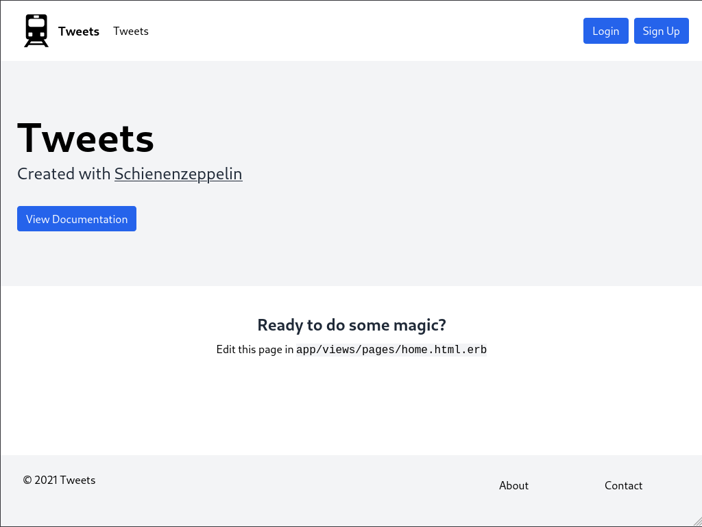
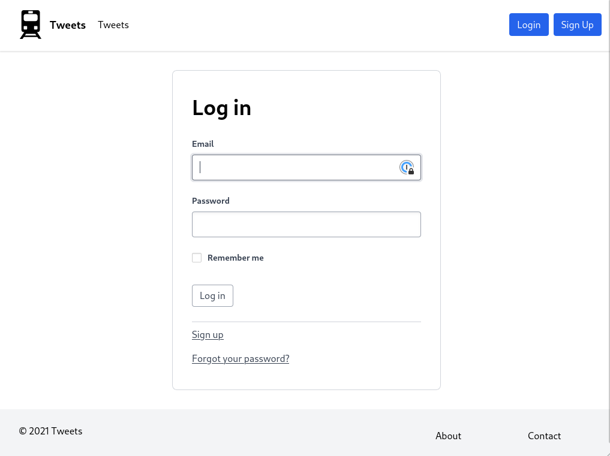
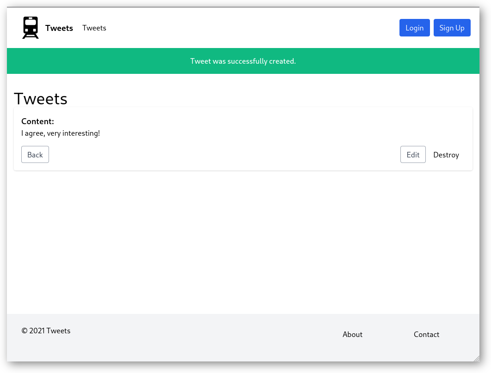
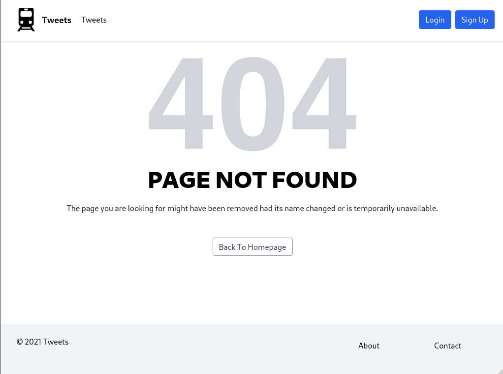

# Gallery

Schienenzeppelin comes with a nice and unobstrusive UI to get you started quickly.

## Home

TailwindCSS and responsive views already done. Minimalism first, so these things stay out of your way.

## Devise

All devise forms (login, sign up, profile...) feature the same simple design.

## Scaffold

Adding new views via `rails scaffold` tends to result in a ton of work to get those to look nice. Not anymore!

## Error Pages

Even if things go wrong, they should look nice, right?

